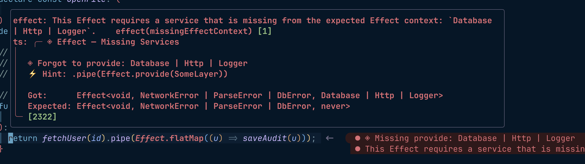
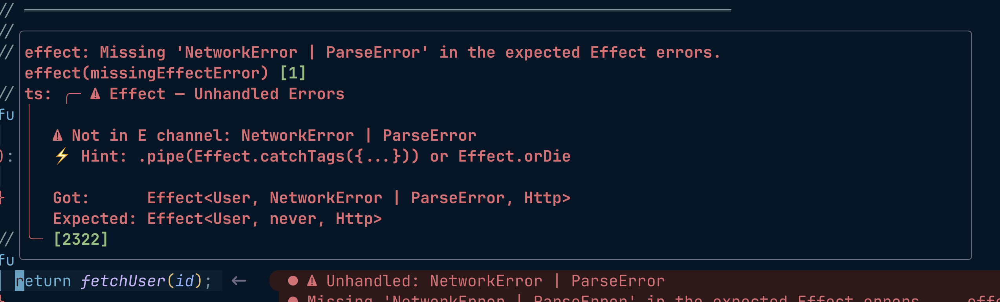
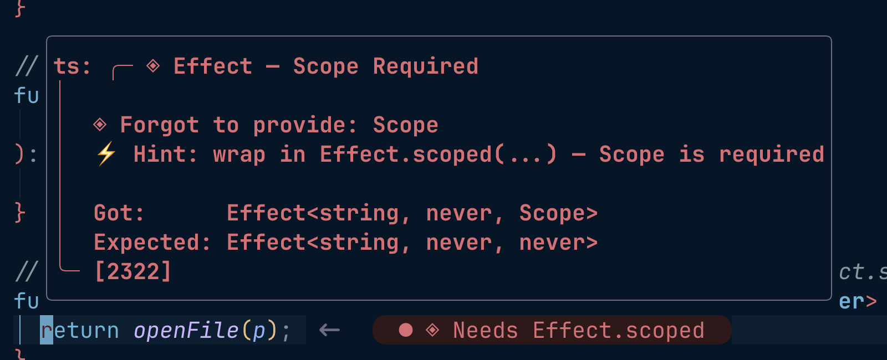
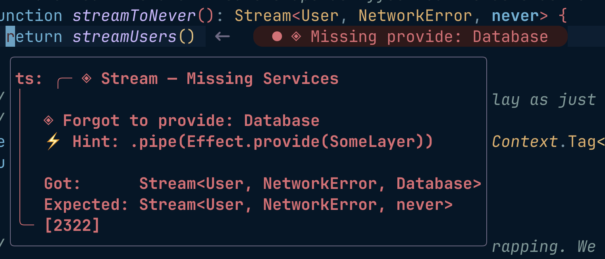
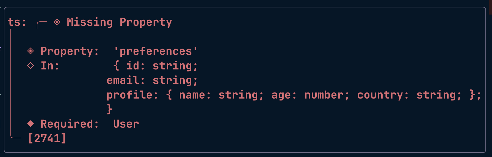
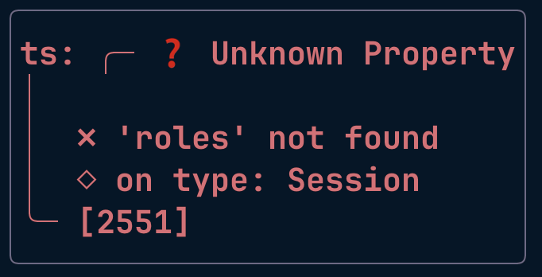
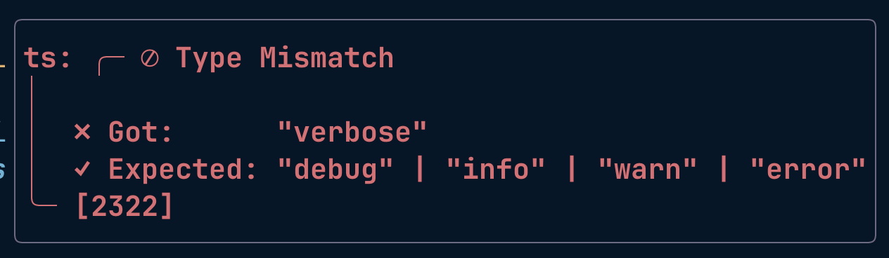

# effect-error-pretty.nvim

An Effect-first TypeScript diagnostic formatter for Neovim. It takes those walls of `Effect<A, E, R>` assignability errors and turns them into something you can actually read, with dedicated handling for the Effect ecosystem's usual pain points.

Regular TypeScript errors get the same treatment too, but Effect is the headline act.

## Why

When you're learning Effect, half the type errors look like this:

```
Type 'Effect<void, DbError, Database | Logger>' is not assignable to type 'Effect<void, DbError, never>'.
```

VSCode and Zed render that as one wrapped line in a tooltip. The part you actually care about ("you forgot to provide `Database | Logger`") is buried in there somewhere.

This plugin parses the error, figures out which channel (A, E, or R) actually diverged, and renders this instead:



```
╭─ ◈ Effect — Missing Services
│
│  ◈ Forgot to provide: Database | Logger
│  ⚡ Hint: .pipe(Effect.provide(SomeLayer))
│
│  Got:      Effect<void, DbError, Database | Logger>
│  Expected: Effect<void, DbError, never>
╰─
```

## Preview

Here are more scenarios the plugin recognizes, shown as they render in the float.

### Unhandled errors (forgot `Effect.catchAll` / `catchTags` / `orDie`)



```
╭─ ⚠ Effect — Unhandled Errors
│
│  ⚠ Not in E channel: NetworkError | ParseError
│  ⚡ Hint: .pipe(Effect.catchTags({...})) or Effect.orDie
│
│  Got:      Effect<User, NetworkError | ParseError, Http>
│  Expected: Effect<User, never, Http>
╰─
```

### Wrong success type (A)

```
╭─ ⊘ Effect — A Mismatch
│
│  ✗ Got A:    User
│  ✓ Expected: string
│
│  Got:      Effect<User, NetworkError | ParseError, Http>
│  Expected: Effect<string, NetworkError | ParseError, Http>
╰─
```

### Scope required

`Scope` gets detected on its own, so the hint suggests `Effect.scoped` instead of a generic `Effect.provide`.



```
╭─ ◈ Effect — Scope Required
│
│  ◈ Forgot to provide: Scope
│  ⚡ Hint: wrap in Effect.scoped(...) — Scope is required
│
│  Got:      Effect<string, never, Scope>
│  Expected: Effect<string, never, never>
╰─
```

### Multi-channel diff

When two or more channels diverge at once, the compact boxes step aside and you get a full tri-channel view with all the annotations stacked at the bottom.

```
╭─ ⊘ Effect Mismatch
│
│  ✗ Got:
│     A: void
│     E: NetworkError | ParseError | DbError
│     R: Http | Database | Logger
│
│  ✓ Expected:
│     A: void
│     E: never
│     R: never
│
│  ◈ Forgot to provide: Http | Database | Logger
│  ⚠ Unhandled errors: NetworkError | ParseError | DbError
╰─
```

### Layer: ROut widening

Layer mismatches get their own channel labels (`ROut / E / RIn`) and a `Layer.provide` / `Layer.merge` hint.

```
╭─ ⊘ Layer — ROut Mismatch
│
│  ✗ Got ROut:    Database | Http
│  ✓ Expected: Database
│
│  Got:      Layer<Database | Http, never, never>
│  Expected: Layer<Database, never, never>
╰─
```

### Stream mismatch

Stream follows the same shape as Effect, but the header is relabeled so you can tell at a glance which constructor you're dealing with.



```
╭─ ◈ Stream — Missing Services
│
│  ◈ Forgot to provide: Database
│  ⚡ Hint: .pipe(Effect.provide(SomeLayer))
│
│  Got:      Stream<User, NetworkError, Database>
│  Expected: Stream<User, NetworkError, never>
╰─
```

### General TypeScript

Everyday TS errors get the same treatment, not just the Effect ones. A few representative cases:

**Missing property** (TS2741). Long object types wrap at `;` boundaries so the shape stays scannable.



```
╭─ ◈ Missing Property
│
│  ◈ Property:  'preferences'
│  ◇ In:        { id: string;
│               email: string;
│               profile: { name: string; age: number; country: string; };
│               }
│  ◆ Required:  User
╰─
```

**Unknown property** (TS2339 / TS2551). The property name gets lifted out of the raw message so the typo jumps right at you.



```
╭─ ❓ Unknown Property
│
│  ✗ 'roles' not found
│  ◇ on type: Session
╰─
```

**Type mismatch** (TS2322 / TS2345). The classic Got/Expected diff, with unions shown inline.



```
╭─ ⊘ Type Mismatch
│
│  ✗ Got:      "verbose"
│  ✓ Expected: "debug" | "info" | "warn" | "error"
╰─
```

## Features

**Effect-specific**
- `Effect<A, E, R>` / `Effect.Effect<A, E, R>` / `Stream<A, E, R>` / `Layer<ROut, E, RIn>` are all parsed, channel-labeled, and diffed
- **Missing services** (forgot `Effect.provide`): a compact box naming the exact services
- **Unhandled errors** (forgot `Effect.catchAll` / `catchTags` / `orDie`): a compact box listing the leftover `E` members
- **Wrong success type**: a compact box with Got/Expected for `A` (or `ROut` for Layer)
- **Scope-required**: detects `Scope` in got.R and suggests `Effect.scoped`
- **`Context.Tag<"Id", Service>` unwrapping**: diffs show just the service name
- **`YieldWrap<...>` unwrapping**: Effect.gen yields render as plain Effect mismatches
- **Short signatures**: `Effect<A>` and `Effect<A, E>` default missing params to `never`
- **Multi-channel view**: falls back to a full tri-channel table when 2+ channels diverge
- **Identical signatures**: when both sides normalize to the same type, says so (and points at duplicate copies of a package) instead of printing a Got/Expected diff of a type against itself
- **Type signature at the bottom** of every compact box so you always see the full `Effect<...>` context

**General TypeScript**
- Type mismatches (TS2322 / TS2345) with multi-line wrapping for big types
- Missing property (TS2741), Unknown property (TS2339)
- Cannot find name / module / exported member (TS2304 / TS2307 / TS2305)
- Implicit any (TS7006), Uninitialized variable (TS2454), Nullish (TS2531 / TS18048)
- Argument count (TS2554 / TS2555, including the `at least N` and `N-M` forms), Const reassignment, Not callable (TS2349)
- Deprecated symbol messages
- Optional fallback to [`format-ts-errors.nvim`](https://github.com/davidosomething/format-ts-errors.nvim) when no pattern matches

## Install

Requires Neovim 0.10+.

### lazy.nvim

```lua
{
  "rashedInt32/effect-error-pretty.nvim",
  version = "*",           -- pin to tagged releases; drop this to track main
  event = { "BufReadPre", "BufNewFile" },
  opts = {
    float = true,          -- auto-patch vim.diagnostic.config.float.format
    effect = true,
    format_ts_errors_fallback = true,
  },
}
```

See the [changelog](CHANGELOG.md) for what's in each release.

### Manual wiring

If you manage `vim.diagnostic.config` yourself, don't set `float = true`. Call the formatter directly:

```lua
local pretty = require("effect-error-pretty")
pretty.setup({ effect = true })

vim.diagnostic.config({
  float = {
    format = function(diagnostic)
      return pretty.float_format(diagnostic) or diagnostic.message
    end,
  },
})
```

### tiny-inline-diagnostic.nvim

```lua
{
  "rachartier/tiny-inline-diagnostic.nvim",
  opts = {
    options = {
      format = function(diagnostic)
        return require("effect-error-pretty").inline_format(diagnostic) or diagnostic.message
      end,
    },
  },
}
```

### Full working example

If you want to see the plugin wired up end-to-end (float format, sign icons, spotlight highlights, and the tiny-inline-diagnostic integration), take a look at the LazyVim config it was developed against:

<https://github.com/rashedInt32/lazyvim-config>

## Options

| Option                       | Default | Description                                                                                               |
|------------------------------|---------|-----------------------------------------------------------------------------------------------------------|
| `effect`                     | `true`  | Recognize `Effect` / `Stream` / `Layer` mismatches as first-class.                                        |
| `float`                      | `false` | Automatically patch `vim.diagnostic.config.float.format` on `setup()`.                                    |
| `sources`                    | `{ typescript=true, ts=true, vtsls=true }` | Diagnostic sources this plugin handles. Exact match only. Merged with the defaults, so `{ deno = true }` *adds* Deno — pass `{ typescript = false }` to drop one. |
| `format_ts_errors_fallback`  | `true`  | When no pattern matches, try [`format-ts-errors.nvim`](https://github.com/davidosomething/format-ts-errors.nvim) if installed. |
| `extra_patterns`             | `nil`   | List of `function(msg) -> {kind, ...}` parsers run after builtins. Let you add custom shapes.              |

If `float = true` and something else later calls `vim.diagnostic.config({ float = ... })`, Neovim replaces the whole `float` table — the formatter reinstalls itself on `LspAttach`, so the ordering doesn't matter.

## Public API

```lua
local pretty = require("effect-error-pretty")

-- Float box (multi-line). Returns nil if unhandled; caller should fall back.
pretty.float_format(diagnostic)

-- Inline one-liner. Returns nil if unhandled.
pretty.inline_format(diagnostic)

-- Low-level: parse a raw TS diagnostic message into a structured kind.
-- Returns nil if no pattern matched.
require("effect-error-pretty.parse").parse(message, { effect = true })
```

## Extending

Want to catch a custom rule? Add your own parser:

```lua
require("effect-error-pretty").setup({
  extra_patterns = {
    function(msg)
      local rule = msg:match("^eslint%-plugin%-effect: (.+)$")
      if rule then
        return { kind = "custom_lint", rule = rule }
      end
    end,
  },
})
```

Render logic for custom `kind`s isn't wired in yet. For now, `parse()` returns the structured result and you render it yourself. If there's demand, we'll expose a renderer registry.

## Tests

```sh
nvim --headless -u tests/minimal_init.lua \
  -c "PlenaryBustedDirectory tests/ { minimal_init = 'tests/minimal_init.lua' }" -c "qa!"
```

`PlenaryBustedDirectory` spawns one child Neovim per spec file, and those children only pick up `minimal_init.lua` if it's passed in the command — without it they load your personal config instead.

Requires [plenary.nvim](https://github.com/nvim-lua/plenary.nvim). `tests/minimal_init.lua` finds it under `stdpath("data")`; set `PLENARY_PATH` if yours lives elsewhere.

## License

MIT
